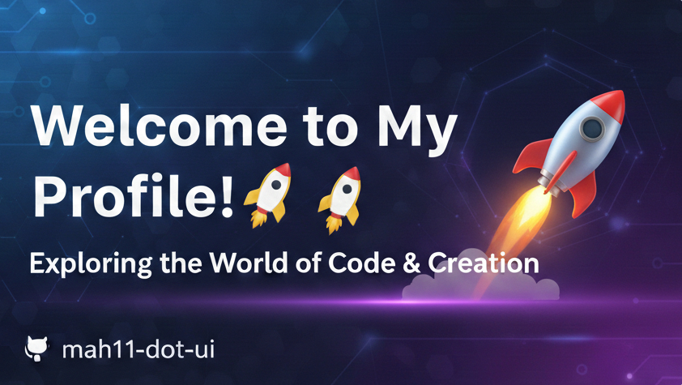

  

   

  ## 💫 About Me
  **Creative Developer & UI Enthusiast** *Exploring the intersection of code, design, and innovation.*

  ---

  ### 🛠️ Tech Stack & Tools
  

   

  ### 📊 GitHub Analytics

  
  

  ---

  ### 🌐 Let's Connect
  
  
  

 

  

